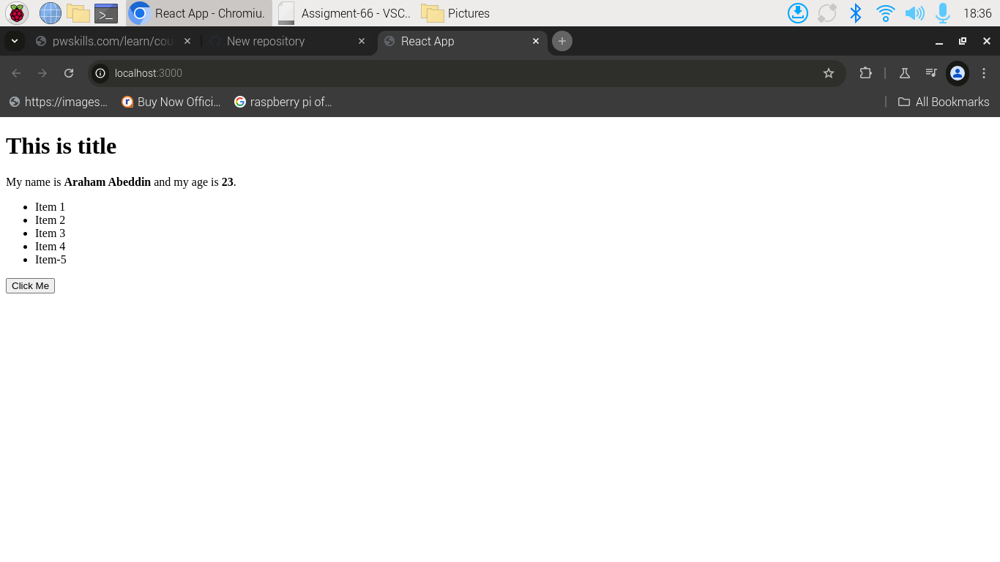
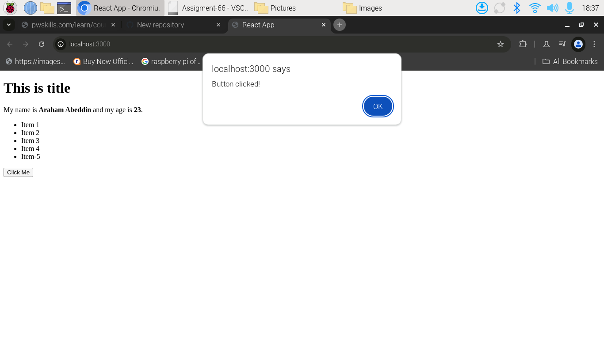

# (A). Install the source code from the github :
```bash

```

# (B). Install the required packages :
```bash
npm install
```

# (C). To run the react app:
```bash
npm start
```


> NOTE : All source code file is preasent in `src` folder.
# (D). `App.js` :
```js

import Person from "./Person.js";
import Header from "./Header.js";
import List from "./List.js";
import Button from "./Button.js";

// items array :---
const items = ['Item 1', 'Item 2', 'Item 3', 'Item 4' , 'Item-5'];

// handling click events :---
const handleClick = () => {
  alert('Button clicked!');
};

const App = () => {
  return (
    <>
    <Header title="This is title"/>
    <Person name="Araham Abeddin" age="23" />
    <List items={items}/>
    <Button text="Click Me" onClick={handleClick} />
    </>
  )
}


export default App;

```

<hr>

## (Q.1). Create a component named `Person` that takes two props - `name` and `age`.The component should display the person's name and age in a paragraph element.

### Solution: (Person.js)

```jsx

const Person = ({ name, age }) => {
    return (
        <>
            <p>
                My name is <b>{name}</b> and my age is <b>{age}</b>.
            </p>
        </>
    )
}


export default Person;

```

## (Q.2). Create a component named `Button` that takes two props - `text` and `onClick`. The component should display a button element with the given text and call the onClick function when clicked.

### Solution: (Button.js)

```jsx

import React from 'react';

const Button = ({ text, onClick }) => {
  return (
    <button onClick={onClick}>
      {text}
    </button>
  );
};

export default Button;

```

## (Q.3). Create a component named `Header` that takes one prop - `title`. The component should display a header element with the given title.

### Solution: (Header.js)

```jsx

const Header = ({ title }) => {
    return (
        <h1>
            <header>
                {title}
            </header>
        </h1>
    )
}


export default Header;

```

## (Q.4). Create a component named `List` that takes one prop - `items`. The component should display an unordered list element with the given list items.

### Solution: (List.js)
```jsx

const List = ({ items }) => {
    return (
        // key={index}
        <ul>
            {items.map((element, index) => (
                <li key={index}>{element}</li>
            ))}
        </ul>
    );
};


export default List;

```

# (E). OUTPUT:---

### (1). output before button click :


### (2). output after button click :
